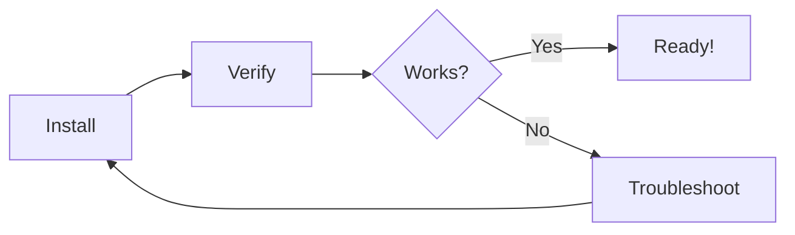

# Chapter 1: Getting Started

{{index: Getting Started}}

This chapter covers the basics of getting started with MD-Book.

[TOC]

## Prerequisites

{{index: Prerequisites}}

Before installing MD-Book, ensure you have the following:

- [ ] Python 3.10 or higher
- [ ] pip package manager
- [ ] A text editor (VS Code recommended)
- [ ] Basic command line knowledge

### System Requirements

| OS | Minimum Version | Recommended |
|----|-----------------|-------------|
| macOS | 12.0 (Monterey) | 14.0 (Sonoma) |
| Linux | Ubuntu 20.04 | Ubuntu 22.04 |
| Windows | Windows 10 | Windows 11 |

## Installation

{{index: Installation}}

Updated installation instructions with multiple methods.

### Method 1: pip (Recommended)

```bash
# Install from PyPI
pip install md-book

# Or with pipx for isolated environment
pipx install md-book
```

### Method 2: From Source

```bash
# Clone the repository
git clone https://github.com/example/md-book.git
cd md-book

# Install in development mode
pip install -e ".[dev]"
```

### Verification

After installation, verify everything works:

```bash
# Check version
mdbook --version

# Expected output:
# md-book 1.0.4
```



## Configuration

{{index: Configuration}}

Create a configuration file named `book.toml` in your project root.

### Basic Configuration

```toml
[book]
title = "Your Book Title"
author = "Author Name"
language = "en"
description = "A brief description of your book"

[build]
build_dir = "build"
```

### Advanced Configuration

```toml
[book]
title = "Advanced Documentation"
author = "Documentation Team"
language = "en"

[build]
build_dir = "build"
create_missing = true

[output.html]
theme = "default"
default_theme = "light"
git_repository_url = "https://github.com/example/my-book"

[output.html.search]
enable = true
limit_results = 30
```

## First Steps

{{index: First Steps}}

Once installed, you can begin creating your book:

### Initialize a New Book

```bash
# Create a new book
mdbook init my-documentation

# Navigate to the book directory
cd my-documentation
```

This creates the following structure:

```
my-documentation/
  book.toml
  SUMMARY.md
  src/
    introduction.md
```

### Add Chapters

```bash
# Add a new chapter
mdbook add "Getting Started"
mdbook add "Core Concepts"
mdbook add "Advanced Topics"
```

### Build the Book

```bash
# Build HTML output
mdbook build

# Or serve with live reload
mdbook serve --port 8080
```

> **Note**: The `serve` command automatically rebuilds when files change.

<!-- NOTE: 2024-01-16T14:30:00 - Consider adding more examples here -->

## Troubleshooting

{{index: Troubleshooting}}

If you encounter issues, try these solutions:

### Common Issues

| Problem | Solution |
|---------|----------|
| `command not found: mdbook` | Ensure pip's bin directory is in PATH |
| Python version error | Upgrade to Python 3.10+ |
| Permission denied | Use `pip install --user md-book` |
| Missing dependencies | Run `pip install md-book[all]` |

### Getting Help

```bash
# Show help
mdbook --help

# Show command-specific help
mdbook add --help
```

### Debug Mode

```bash
# Enable verbose logging
mdbook --verbose build

# Show full traceback on errors
mdbook --debug build
```

If issues persist:

1. Check your Python version: `python --version`
2. Verify the installation: `pip show md-book`
3. Review the configuration file for syntax errors
4. Check file permissions in the book directory

<!-- NOTE: 2024-01-20T10:00:00 - Added comprehensive troubleshooting section -->
