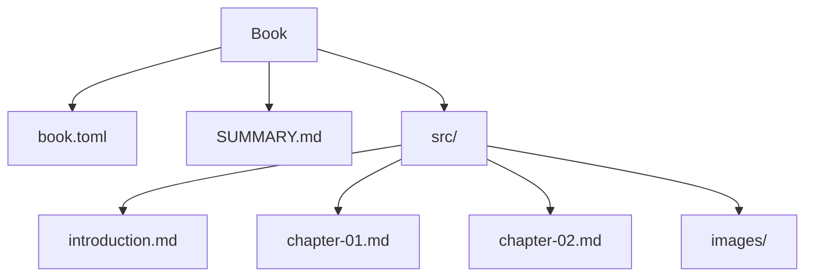
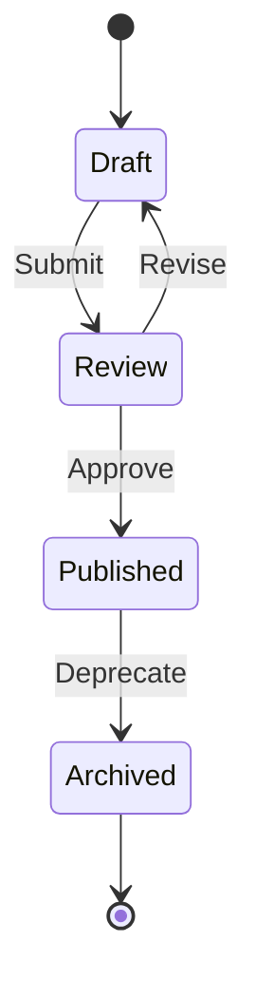
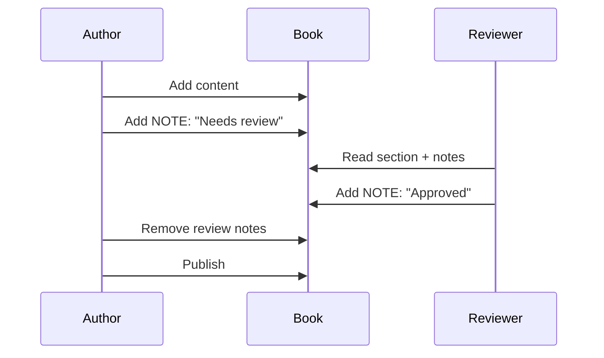

# Chapter 2: Core Concepts

{{index: Core Concepts}}

Understanding the core concepts is essential for effective use of MD-Book.

[TOC]

## Book Structure

{{index: Book Structure}}

A book consists of several key components:



### Components Overview

| Component | Purpose | Required |
|-----------|---------|:--------:|
| `book.toml` | Configuration | Yes |
| `SUMMARY.md` | Table of contents | Yes |
| `src/` | Content directory | Yes |
| `introduction.md` | Book introduction | No |
| `images/` | Image assets | No |

<!-- NOTE: 2026-01-19T22:51:59 - Section structure looks good -->

## Working with Chapters

{{index: Chapters}}

Chapters are numbered markdown files in the `src/` directory.

### File Naming

Use consistent naming conventions:

```
src/
  introduction.md      # Chapter 0 (intro)
  chapter-01.md        # Chapter 1
  chapter-02.md        # Chapter 2
  chapter-03-api.md    # Chapter 3 with descriptor
```

### Chapter Metadata

Each chapter can have YAML frontmatter:

```yaml
---
title: My Chapter
draft: false
authors:
  - Alice
  - Bob
tags:
  - tutorial
  - beginner
---

# Chapter Content Starts Here
```

### Chapter Lifecycle



## Working with Sections

{{index: Sections}}

Sections are defined by `##` headings within a chapter.

### Section Structure

```markdown
# Chapter Title

Introduction paragraph...

## Section 1

Content for section 1...

## Section 2

Content for section 2...

### Subsection 2.1

Nested content...
```

### Section Operations

Each section can be:

- **Read individually**: Get content by heading or index
- **Updated**: Modify without affecting other sections
- **Annotated**: Add timestamped notes

```python
# Python API example
from mdbook import Book

book = Book.open("my-book")
chapter = book.get_chapter(2)

# Read a section
section = chapter.get_section("Working with Sections")
print(section.content)

# Update a section
chapter.update_section(
    "Working with Sections",
    "New content here..."
)
```

## The Note System

{{index: Notes}}

Notes are HTML comments with timestamps, invisible in rendered output but visible to editors and Claude.

### Note Format

```html
<!-- NOTE: 2024-01-19T15:30:00 - Your note here -->
```

### Note Types

| Type | Use Case | Example |
|------|----------|---------|
| Review | Mark for review | `Needs fact-checking` |
| TODO | Action items | `Add code example` |
| Question | Seek clarification | `Is this accurate?` |
| Approval | Sign-off | `QA verified` |

### Working with Notes



### Note Best Practices

1. **Be specific**: Include actionable information
2. **Date-stamp**: Always use ISO format timestamps
3. **Clean up**: Remove resolved notes before publishing
4. **Categorize**: Use consistent prefixes (TODO, REVIEW, etc.)

> **Warning**: Notes are visible in the raw markdown. Do not include sensitive information.

## Content Organization

{{index: Organization}}

### Recommended Structure

```
src/
  introduction.md           # Overview and getting started
  chapter-01-basics.md      # Fundamental concepts
  chapter-02-intermediate.md # Building on basics
  chapter-03-advanced.md    # Expert topics
  chapter-04-reference.md   # API/CLI reference
  appendix-a.md             # Additional resources
  images/
    diagram-01.svg
    screenshot-01.png
```

### Cross-References

Link between chapters:

```markdown
See [Getting Started](chapter-01.md) for installation.
For advanced topics, refer to [Chapter 3](chapter-03.md#custom-workflows).
```

<!-- NOTE: 2024-01-20T11:00:00 - Added comprehensive content organization section -->
