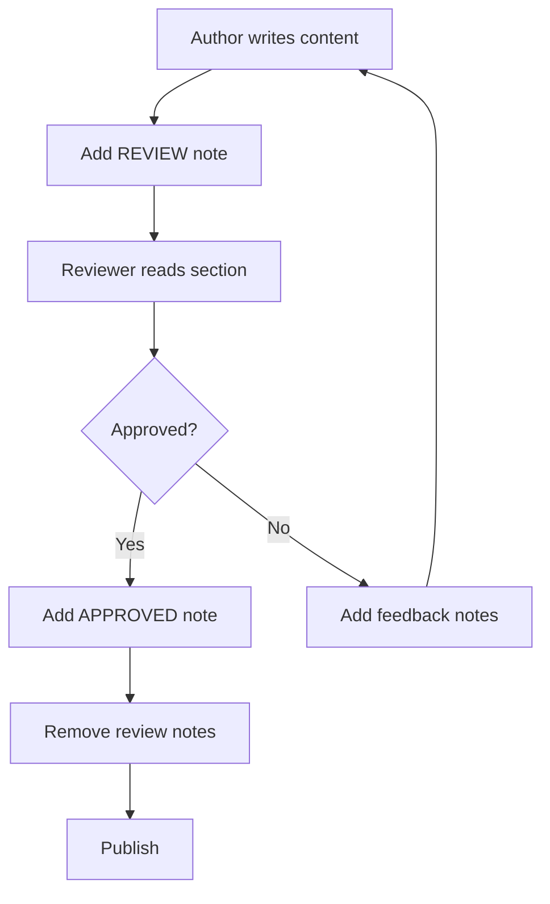
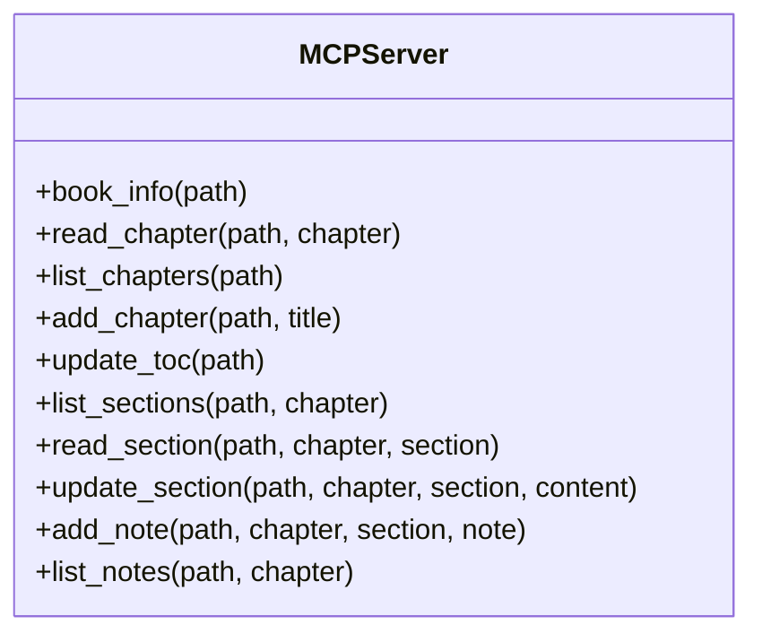
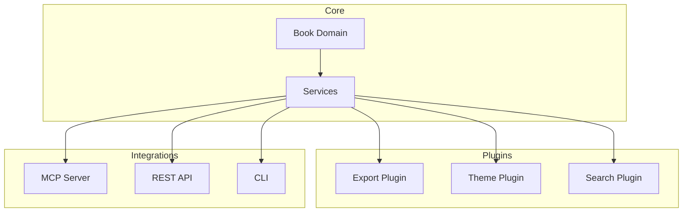

# Chapter 3: Advanced Topics

{{index: Advanced Topics}}

This chapter covers advanced features and workflows.

[TOC]

## Custom Workflows

{{index: Workflows}}

You can create custom workflows for various use cases.

### Automated Review Cycle



### Collaborative Editing

Multiple authors can work on the same book:

```yaml
# book.toml
[collaboration]
mode = "async"
review_required = true
reviewers = ["alice@example.com", "bob@example.com"]
```

### Version Tracking

Track changes with Git integration:

```bash
# Initialize git in book directory
git init

# Create a branch for major edits
git checkout -b chapter-2-rewrite

# Commit after significant changes
git add src/chapter-02.md
git commit -m "docs: rewrite chapter 2 sections"
```

<!-- NOTE: 2024-01-17T09:15:00 - This section needs expansion -->

## Integration with Claude

{{index: Claude Integration}}

The MCP server enables Claude to interact with books programmatically.

### Available Operations



### Operation Details

| Operation | Description | Parameters |
|-----------|-------------|------------|
| `book_info` | Get book metadata | path |
| `read_chapter` | Read full chapter content | path, chapter |
| `list_sections` | List sections in a chapter | path, chapter |
| `read_section` | Read specific section | path, chapter, section |
| `update_section` | Modify section content | path, chapter, section, content |
| `add_note` | Add annotation | path, chapter, section, note |
| `list_notes` | Show all notes | path, chapter |

### Example Session

```
User: "What chapters are in the book at ./docs?"

Claude uses: list_chapters(path="./docs")

Claude: "The book has 4 chapters:
1. Getting Started
2. Core Concepts  
3. Advanced Topics
4. Feature Showcase"

User: "Add a note to the Installation section saying it needs screenshots"

Claude uses: add_note(
    path="./docs",
    chapter=1,
    section="Installation",
    note="Add screenshots for each installation step"
)

Claude: "Done! Added the note to the Installation section."
```

## Best Practices

{{index: Best Practices}}

### Organizing Content

Keep sections focused on single topics:

| Good | Bad |
|------|-----|
| "Installation" | "Installation and Configuration and Troubleshooting" |
| "API Reference" | "Everything About the API" |
| "Error Handling" | "Errors, Warnings, and Logs" |

### Using Notes Effectively

```markdown
<!-- Good notes -->
<!-- NOTE: 2024-01-19T10:00:00 - TODO: Add Python 3.12 compatibility note -->
<!-- NOTE: 2024-01-19T11:00:00 - REVIEW: Verify these steps work on Windows -->

<!-- Bad notes -->
<!-- NOTE: fix this -->
<!-- NOTE: 2024-01-19 - needs work -->
```

### Documentation Standards

Follow these standards for consistency:

1. **Headings**: Use sentence case ("Getting started", not "Getting Started")
2. **Code blocks**: Always specify language for syntax highlighting
3. **Links**: Use relative paths for internal links
4. **Images**: Include alt text and captions
5. **Tables**: Align columns consistently

<!-- NOTE: 2024-01-18T16:45:00 - Add examples of note usage -->

### Version Control

Always commit after significant changes:

```bash
# Good commit messages
git commit -m "docs: add installation troubleshooting section"
git commit -m "docs: update API reference for v2.0"
git commit -m "fix: correct code example in chapter 3"
```

## Future Enhancements

{{index: Future}}

Planned features for upcoming releases:

### Roadmap

- [x] Section-level editing (v1.0)
- [x] Note annotations (v1.0)
- [ ] Section reordering (v1.1)
- [ ] Bulk note operations (v1.1)
- [ ] PDF export (v1.2)
- [ ] EPUB export (v1.2)
- [ ] Real-time collaboration (v2.0)
- [ ] Plugin system (v2.0)

### Proposed Architecture



### Contributing

Want to help? Here's how:

1. Fork the repository
2. Create a feature branch
3. Make your changes
4. Submit a pull request

See [CONTRIBUTING.md](https://github.com/example/md-book/blob/main/CONTRIBUTING.md) for detailed guidelines.

<!-- NOTE: 2024-01-20T12:30:00 - Keep roadmap updated as features are released -->
