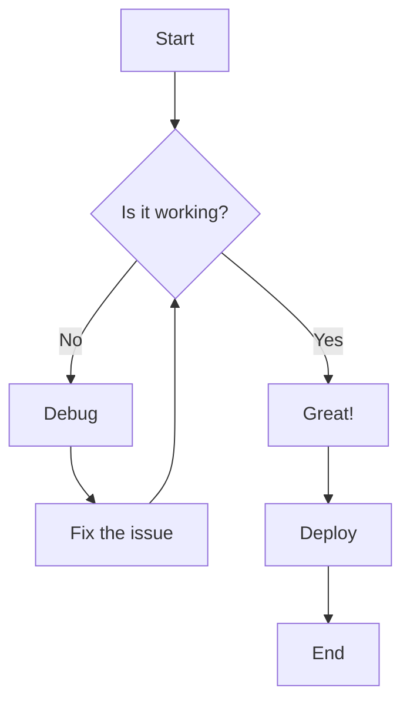
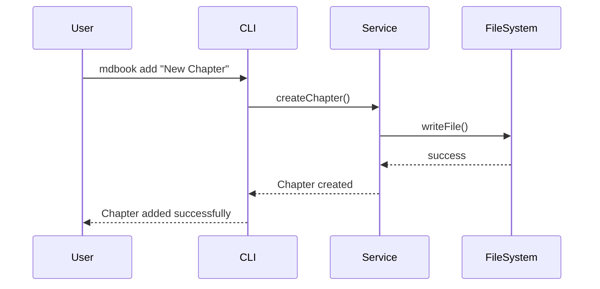
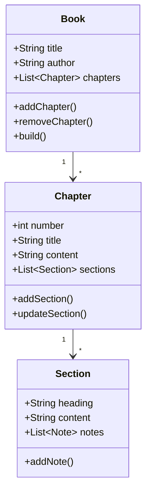
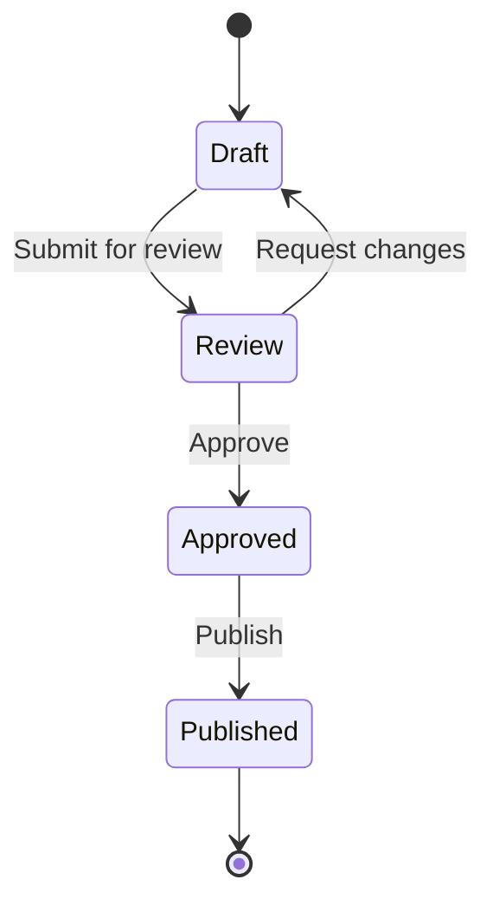
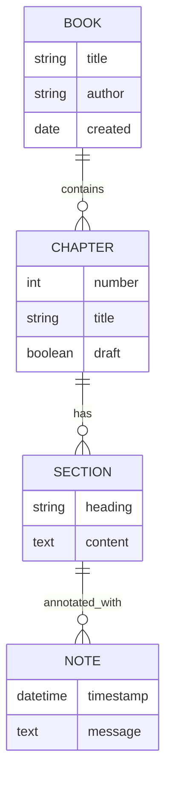
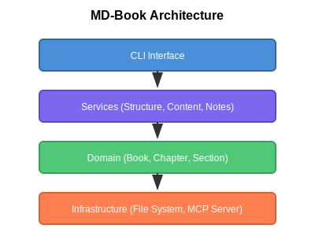
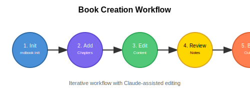
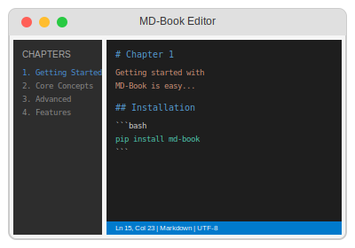

# Chapter 4: Feature Showcase

{{index: Feature Showcase}}

This chapter demonstrates all supported Markdown features for testing purposes.

[TOC]

## Mermaid Diagrams

{{index: Mermaid diagrams}}

MD-Book supports Mermaid diagrams for creating visual documentation.

### Flowchart



### Sequence Diagram



### Class Diagram



### State Diagram



### Entity Relationship Diagram



## Images and SVG Diagrams

{{index: Images}}

### Architecture Diagram



*Figure 1: Clean architecture layers of MD-Book*

### Workflow Diagram



*Figure 2: The iterative book creation process*

### UI Mockup



*Figure 3: Conceptual UI for an MD-Book editor*

## Code Blocks with Syntax Highlighting

{{index: Code blocks}}

### Python Example

```python
from dataclasses import dataclass
from typing import List, Optional
from datetime import datetime

@dataclass
class Note:
    """A timestamped annotation on a section."""
    timestamp: datetime
    message: str
    
    def to_html_comment(self) -> str:
        return f"<!-- NOTE: {self.timestamp.isoformat()} - {self.message} -->"

@dataclass
class Section:
    """A section within a chapter, defined by a ## heading."""
    heading: str
    content: str
    notes: List[Note] = None
    
    def __post_init__(self):
        if self.notes is None:
            self.notes = []
    
    def add_note(self, message: str) -> Note:
        note = Note(timestamp=datetime.now(), message=message)
        self.notes.append(note)
        return note
```

### JavaScript/TypeScript Example

```typescript
interface Chapter {
  number: number;
  title: string;
  content: string;
  sections: Section[];
  draft: boolean;
}

interface Section {
  heading: string;
  content: string;
  notes: Note[];
}

interface Note {
  timestamp: Date;
  message: string;
}

class BookService {
  private chapters: Map<number, Chapter> = new Map();
  
  addChapter(title: string): Chapter {
    const number = this.chapters.size + 1;
    const chapter: Chapter = {
      number,
      title,
      content: `# ${title}\n\n`,
      sections: [],
      draft: true
    };
    this.chapters.set(number, chapter);
    return chapter;
  }
  
  async buildBook(): Promise<void> {
    for (const [num, chapter] of this.chapters) {
      console.log(`Building chapter ${num}: ${chapter.title}`);
      // Build logic here
    }
  }
}
```

### Rust Example

```rust
use std::collections::HashMap;
use chrono::{DateTime, Utc};

#[derive(Debug, Clone)]
pub struct Note {
    pub timestamp: DateTime<Utc>,
    pub message: String,
}

#[derive(Debug)]
pub struct Section {
    pub heading: String,
    pub content: String,
    pub notes: Vec<Note>,
}

impl Section {
    pub fn new(heading: &str, content: &str) -> Self {
        Self {
            heading: heading.to_string(),
            content: content.to_string(),
            notes: Vec::new(),
        }
    }
    
    pub fn add_note(&mut self, message: &str) -> &Note {
        let note = Note {
            timestamp: Utc::now(),
            message: message.to_string(),
        };
        self.notes.push(note);
        self.notes.last().unwrap()
    }
}

pub struct Book {
    pub title: String,
    pub author: String,
    chapters: HashMap<u32, Chapter>,
}

impl Book {
    pub fn new(title: &str, author: &str) -> Self {
        Self {
            title: title.to_string(),
            author: author.to_string(),
            chapters: HashMap::new(),
        }
    }
}
```

### Go Example

```go
package mdbook

import (
    "fmt"
    "time"
)

// Note represents a timestamped annotation
type Note struct {
    Timestamp time.Time
    Message   string
}

// Section represents a ## heading block in a chapter
type Section struct {
    Heading string
    Content string
    Notes   []Note
}

// Chapter represents a single chapter file
type Chapter struct {
    Number   int
    Title    string
    Content  string
    Sections []Section
    Draft    bool
}

// Book represents the entire book structure
type Book struct {
    Title    string
    Author   string
    Chapters map[int]*Chapter
}

// NewBook creates a new book with the given metadata
func NewBook(title, author string) *Book {
    return &Book{
        Title:    title,
        Author:   author,
        Chapters: make(map[int]*Chapter),
    }
}

// AddChapter adds a new chapter to the book
func (b *Book) AddChapter(title string) *Chapter {
    num := len(b.Chapters) + 1
    chapter := &Chapter{
        Number:  num,
        Title:   title,
        Content: fmt.Sprintf("# %s\n\n", title),
        Draft:   true,
    }
    b.Chapters[num] = chapter
    return chapter
}
```

### Shell/Bash Example

```bash
#!/bin/bash
# MD-Book installation and setup script

set -euo pipefail

INSTALL_DIR="${HOME}/.local/bin"
VERSION="1.0.4"

echo "Installing MD-Book v${VERSION}..."

# Check Python version
python_version=$(python3 --version 2>&1 | cut -d' ' -f2)
required_version="3.10"

if [[ "$(printf '%s\n' "$required_version" "$python_version" | sort -V | head -n1)" != "$required_version" ]]; then
    echo "Error: Python ${required_version}+ is required (found ${python_version})"
    exit 1
fi

# Install via pip
pip install --upgrade md-book

# Verify installation
if command -v mdbook &> /dev/null; then
    echo "MD-Book installed successfully!"
    mdbook --version
else
    echo "Installation failed"
    exit 1
fi
```

## Tables

{{index: Tables}}

### Feature Comparison Table

| Feature | Basic | Pro | Enterprise |
|---------|:-----:|:---:|:----------:|
| Chapter Management | Yes | Yes | Yes |
| Section Editing | Yes | Yes | Yes |
| Note Annotations | - | Yes | Yes |
| Mermaid Diagrams | - | Yes | Yes |
| Custom Themes | - | - | Yes |
| Team Collaboration | - | - | Yes |
| API Access | - | - | Yes |

### Supported File Types

| Extension | Type | Supported | Notes |
|-----------|------|:---------:|-------|
| `.md` | Markdown | Yes | Primary format |
| `.toml` | Config | Yes | Book configuration |
| `.svg` | Image | Yes | Vector graphics |
| `.png` | Image | Yes | Raster images |
| `.mermaid` | Diagram | Yes | Standalone diagrams |
| `.html` | Output | Yes | Build output |

### Command Reference

| Command | Description | Example |
|---------|-------------|---------|
| `init` | Initialize a new book | `mdbook init my-book` |
| `add` | Add a new chapter | `mdbook add "Chapter Title"` |
| `build` | Build the book | `mdbook build` |
| `serve` | Start dev server | `mdbook serve --port 8080` |
| `info` | Show book info | `mdbook info` |

## Task Lists

{{index: Task lists}}

### Project Roadmap

- [x] Basic book structure
- [x] Chapter management
- [x] Section-level editing
- [x] Note annotations
- [ ] Real-time collaboration
- [ ] Export to PDF
- [ ] Plugin system
- [ ] Theme customization

### Testing Checklist

- [x] Unit tests passing
- [x] Integration tests passing
- [ ] Performance benchmarks
- [ ] Security audit
- [ ] Documentation review
- [x] Code coverage > 80%

## Footnotes

{{index: Footnotes}}

MD-Book uses clean architecture principles[^1] to separate concerns and maintain testability. The domain layer contains pure business logic[^2], while the infrastructure layer handles external dependencies.

The MCP (Model Context Protocol) integration[^3] allows Claude to interact with books programmatically, enabling AI-assisted authoring workflows.

[^1]: Clean Architecture was popularized by Robert C. Martin (Uncle Bob) and emphasizes separation of concerns through concentric layers.

[^2]: Pure business logic means no side effects or dependencies on external systems like databases or file systems.

[^3]: MCP is Anthropic's protocol for connecting AI assistants to external tools and data sources.

## Blockquotes and Callouts

{{index: Blockquotes}}

> **Note**: This is an informational callout providing additional context about a feature.

> **Warning**: Be careful when using this feature in production environments without proper testing.

> **Tip**: You can combine multiple features in a single chapter for maximum flexibility.

### Nested Blockquotes

> This is a top-level quote about software architecture.
>
> > "Any fool can write code that a computer can understand. Good programmers write code that humans can understand."
> > 
> > -- Martin Fowler
>
> Keep this principle in mind when writing documentation.

## Mathematical Notation

{{index: Math notation}}

When discussing algorithms, we often need mathematical notation:

- Time complexity: O(n log n)
- Space complexity: O(n)
- Big-O notation: f(n) = O(g(n))

For inline math: The quadratic formula is x = (-b +/- sqrt(b^2 - 4ac)) / 2a

## Horizontal Rules and Separators

---

The above line is a horizontal rule, useful for separating major sections.

***

Triple asterisks also create a horizontal rule.

___

Triple underscores work too.

## Links and References

{{index: Links}}

### External Links

- [MD-Book GitHub Repository](https://github.com/example/md-book)
- [Mermaid Documentation](https://mermaid.js.org/)
- [Markdown Guide](https://www.markdownguide.org/)

### Internal References

See [Chapter 1: Getting Started](chapter-01.md) for installation instructions.

Refer to [Core Concepts](chapter-02.md#book-structure) for understanding book structure.

## Definition Lists

{{index: Definition lists}}

Term 1
: Definition for term 1, explaining what it means in the context of MD-Book.

Term 2
: Definition for term 2.
: Can have multiple definitions.

MCP
: Model Context Protocol - Anthropic's standard for AI tool integration.

TOML
: Tom's Obvious Minimal Language - Configuration file format used by MD-Book.

## Abbreviations

The HTML specification is maintained by the W3C.

*[HTML]: Hyper Text Markup Language
*[W3C]: World Wide Web Consortium

## Emoji Support

While MD-Book focuses on technical documentation, emoji can add visual interest:

- Status indicators: :white_check_mark: :x: :warning:
- Ratings: :star: :star: :star: :star: :star:
- Categories: :book: :pencil: :gear: :rocket:

## Summary

{{index: Summary}}

This chapter has demonstrated:

1. **Mermaid Diagrams**: Flowcharts, sequence diagrams, class diagrams, state diagrams, and ERDs
2. **Images**: SVG diagrams with captions
3. **Code Blocks**: Python, JavaScript/TypeScript, Rust, Go, and Bash with syntax highlighting
4. **Tables**: Feature comparisons, reference tables, and data tables
5. **Task Lists**: Interactive checklists
6. **Footnotes**: Reference annotations
7. **Blockquotes**: Callouts and nested quotes
8. **Mathematical Notation**: Inline formulas
9. **Links**: External and internal references
10. **Definition Lists**: Term definitions

Use these features to create rich, informative documentation.

<!-- NOTE: 2024-01-20T12:00:00 - This chapter serves as a comprehensive feature test -->
