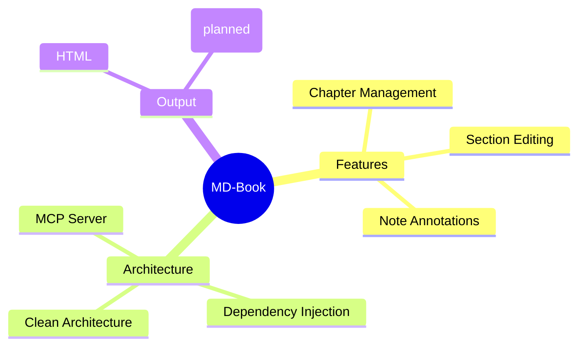
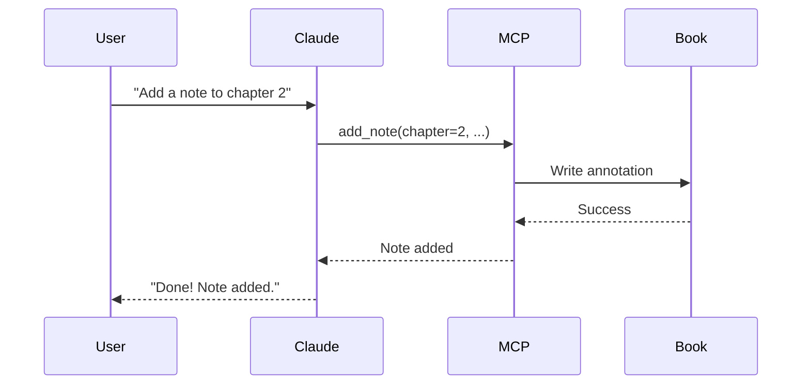

# Introduction

{{index: Introduction}}

Welcome to this sample book for testing md-book features.

[TOC]

## About This Book

{{index: About}}

This book demonstrates the section-level editing capabilities of md-book, a Python-based documentation tool with clean architecture and MCP integration.



<!-- NOTE: 2026-01-19T22:51:48 - QA verified this section -->

## Key Features

| Feature | Description |
|---------|-------------|
| Section Editing | Edit individual sections without affecting others |
| Note System | Add timestamped annotations for collaboration |
| MCP Integration | AI-assisted authoring via Claude |
| Clean Architecture | Maintainable, testable codebase |

## How to Use

{{index: Usage}}

Use the MCP tools to read, edit, and annotate sections.

### Quick Start

1. Install with `pip install md-book`
2. Initialize: `mdbook init my-book`
3. Add chapters: `mdbook add "My Chapter"`
4. Build: `mdbook build`

### Using with Claude



<!-- NOTE: 2024-01-15T10:00:00 - This is an example note -->

## Project Structure

```
my-book/
  book.toml         # Book configuration
  SUMMARY.md        # Table of contents
  src/
    introduction.md # This file
    chapter-01.md   # First chapter
    chapter-02.md   # Second chapter
    images/         # Image assets
```

> **Tip**: Keep your chapters focused on single topics for better organization and maintainability.
